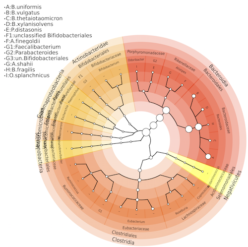

# MetaFlow 
*MetaFlow* is a program for community profiling of a metagenomic sample. It reports the known species present in a metagenomics sample and their abundances (relative to the known reference genomes). See more details about *MetaFlow* (including the manuscript describing it) at [http://www.cs.helsinki.fi/en/gsa/metaflow](http://www.cs.helsinki.fi/en/gsa/metaflow). 

**A concise tutorial coming soon!**

**Version: 0.9.1. Contact: tomescu [at] cs.helsinki.fi, ahmed.sobih [at] helsinki.fi**

# 1. Installing and compiling

*MetaFlow* is written in C++ and requires the free [LEMON library](http://lemon.cs.elte.hu). We provide a precompiled version of LEMON in the directory **Src/lemon_binaries_linux**. If you need to use your own compilation of LEMON, update the variable **PATH_TO_LEMON** in *Makefile*.

To install *MetaFlow*, run in the **metaflow** directory:

	make

This will create the executable **metaflow** in the same directory.

# 2. Preparing the input

*MetaFlow*'s input is a graph-based representation, in LEMON's **LGF** format (LEMON Graph Format), of the alignments of the metagenomic reads in a collection of reference bacterial genomes. We experimented only with *BLAST* alignments (though any aligner could be used). We provide a script *Create_Blast_DB.py* (see Section **5.3 Creating BLAST database** below) which downloads all reference genomes from NCBI ([ftp://ftp.ncbi.nlm.nih.gov/genomes/archive/old_refseq/Bacteria/all.fna.tar.gz](ftp://ftp.ncbi.nlm.nih.gov/genomes/archive/old_refseq/Bacteria/all.fna.tar.gz)) and builds a BLAST database from them.  

We created a Python script **BLAST_TO_LGF.py** which converts *BLAST*'s output to an input **LGF** file for *MetaFlow*. Run:

	python BLAST_TO_LGF.py Read_Mappings.blast Genome_File Average_Read_Length Sequencing_Machine
	
which produces the file *Read_Mappings.lgf* in the same directory as the Read_Mappings.blast file. The parameters are:

- **Read_Mappings.blast**: Blast output file. It must be the tabular format with format=6.
- **Genome_File**: a file containing the genomes in the reference database and their lengths. We provide one for NCBI database in the folder **NCBI**, retrieved on June 10, 2015. If you are using different or updated database, you need to update or change the genome file to incorporate all the reference genomes. This file format is explained in Section **Genome file** below. 
- **Average_Read_Length**: The average read length of the metagenomics read in the fasta file. 
- **Sequencing_Machine**: Integer value (0 For Illumina, 1 For 454 Pyrosequencing)
	
See Section **Genome File** below if you want to write your own script for converting read alignments (e.g. from a different aligner than *BLAST*) to the **LGF** format required for running *MetaFlow*.
	
#### Example

Download a sample blast alignment file (by default to **Example/MCF_Sample_100.blast**) by running in the **metaflow** folder:

	make example
	
Then run	

	python BLAST_TO_LGF.py Example/MCF_Sample_100.blast NCBI/NCBI_Ref_Genome.txt 250 1
	
to produce the output file **Example/MCF_Sample_100.blast.lgf** for this sample. 

# 3. Running MetaFlow

Run the following command:

	./metaflow -m input.lgf -g Genome_File.txt -c metaflow.config

where

- **input.lgf**: the input file prepared from a read alignment file (see the previous section, **Preparing the input**)
- **Genome_File.txt**: a file containing the genomes in the reference database and their lengths. We provide one for NCBI database in the folder **NCBI**, retrieved on June 10, 2015. If you are using different or updated database, you need to update or change the genome file to incorporate all the reference genomes. This file format is explained in Section **Genome file** below.
- **metaflow.config**: the configuration file (see below)

#### Example

	./metaflow -m Example/MCF_Sample_100.blast.lgf -g NCBI/NCBI_Ref_Genome.txt -c metaflow.config

## 3.1 Configuration file

You can configure some parameters of *MetaFlow* by editting the file *metaflow.config* (which you must pass to metaflow with the parameter -c). The list of all these parameters and their meaning is described in the Supplementary Material of the paper. The main ones are the following ones. Decrease their value if the sample has low coverage (but false positives may be introduced).

- **REQUIRED_MIN_ABUNDANCE** For any species, if the absolute abundance is lower than REQUIRED_MIN_ABUNDANCE, then that species is considered an outlier and will be removed (default=**0.3**).
- **REQUIRED_AVERAGE_CHUNKS_COVERAGE** For any species, if the average coverage of its chunks (number of reads/number of chunks) is lower than REQUIRED_AVERAGE_CHUNKS_COVERAGE, then the species is considered an outlier and will be removed (default=**2**). 
- **REQUIRED_MAX_PER_OF_EMPTY_CHUNKS** For any species, if the ratio between number of chunks not covered by any read and the total number of chunks is more than REQUIRED_MAX_PER_OF_EMPTY_CHUNKS, then the species will be considered an outlier and will be removed (values in [0..1]) (default=**0.4**). 

# 4. Reading the output

All output files are in CSV format (TAB-separated, not COMMA separated) to make any further analysis easy. They will be generated in the same folder where the input LGF file is located. The main output file is **abundance.csv**. All output files are described below.

|	File 						|	Description																					|
|-------------------------------|-----------------------------------------------------------------------------------------------|
| **abundance.csv** 				| The main output file. It contains the final estimation of the species richness and abundance.	**The abundances are relative to the known species (from the Genome_file)**. |
| **dist.csv** 						| It contains the final distribution of the reads over all chunks in all known genomes.				|
| Step0.abundance.csv			| Intermediary internal files that contain the estimation of the species richness and abundance	|
| Step1.abundance.csv			| Intermediary adundances after Step 1															|
| Step2.abundance.csv			| Intermediary adundances after Step 2															|
| Step3.abundance.csv			| Intermediary adundances after Step 3															|
| Step0.dist.csv				| Intermediary internal files that contains the distribution of the reads over the genome chunks|
| Step1.dist.csv				| Intermediary read distribution after Step 1													|
| Step2.dist.csv				| Intermediary read distribution after Step 2 													|
| Step3.dist.csv				| Intermediary read distribution after Step 3 													|

## 4.1 Drawing a circular cladogram using GraPhlAn

We provide a Python script for converting MetaFlow's output **abundance.csv** file into an SVG image containing a circular representation as this one 

based on [Nicola Segata](http://cibiocm.bitbucket.org)'s [GraPhlAn](https://bitbucket.org/nsegata/graphlan/src). First install GraPhlAn as described in its manual. Then, run

	python Drawing/draw.py -i Abundance_File.csv -g Path_to_Graphlan/

where 

- **Abundance_File.csv** is the output of MetaFlow
- **Path_to_Graphlan** is the path to the GraPhlAn installation in your filesystem (include the final '/')
	
#### Example

	python Drawing/draw.py -i Drawing/example.csv -g ~/graphlan/
	

# 5. Additonal information
## 5.1 Genome file

We already provide one for the NCBI database, retrieved on June 10, 2015, in the folder **NCBI**. **Read this section if you want to add new known genome references to the analysis**.

The genome file contains a list of the bacterial genomes and their length. Do not include plasmids. Each line has the format:

	GenomeName\tGenomeLength

with the following rules (\t is the TAB character) :

- **GenomeName** is in the format GeneraName_SpeciesName,
- **GenomeLength** is the length of the genome. If one species has different strains with different lengths, select the shortest one.

#### Example

	Corynebacterium_diphtheriae		2395441
	Methylomonas_methanica	5051681
	Paenibacillus_sp._JDR-2	7184930
	Psychroflexus_torquis	4321832
	Shewanella_woodyi	5935403
	Erwinia_amylovora	3805573
	Brucella_ovis	1164220

## 5.2 LGF Format

**Read this section if you are writing your own script to convert read alignments into the LGF format needed as input for *MetaFlow* (for example if you are using a different aligner than BLAST).** See also [LGF format](http://lemon.cs.elte.hu/pub/doc/latest/a00002.html) in the LEMON documentation.

The file format is the following one (\t is the TAB character):

#### 5.2.1 Node header

The file starts with two lines marks the beginning of:

	@nodes
	label\tgenome

#### 5.2.2 Genome chunk nodes

Next follows a sequence of lines with the format 

	GenomeId_ChunkNumber\tGenomeId

Consider for exmaple the **Brucella_ovis** genome from the Genome file (see the previous section **Genome file**), and assume that it appear on line **403** in this file. In the LGF file its **GenomeId** is automatically taken its line number - 1, that is, **402**. Its genome length in the file is **1164220**. Its genome is divided into chunks of a speficied size (suppose 2000 for this example); thus it will be divided into **583** chunks (numbered from 0 to 582) for this genome. These 583 chunks should be added as follows:

	402_0	402
	402_1	402
	.....	...
	.....	...
	402_582	402

#### 5.2.3 Read nodes

Next follows a list of all reads in the form 

	ReadName\t-1
	
For example if we have 10 reads named in the fasta file (r1, r2, ..., r10), we add the following lines

	r1	-1
	r2	-1
	..	-1
	..	-1
	r10	-1

#### 5.2.4 Arcs (mappings) header

The next two lines mark the start of mapping from read to chunks.

	@arcs 
	\t\tlabel\tcost

#### 5.2.5 Mappings of reads to genome chunks

If there is a read **r1** that maps to chunk **3** in genome **1**, add a line

	r1\t1_3\tCounter\tCost

Where **Counter** is an integer counter that starts from 0, and **Cost** is a transformation of the read alignment score into a cost (lower is better). Our BLAST_TO_LGF.py script uses the following transformation: cost = |score - max_score| + min_score.

#### 5.2.6 Summary header 

The next line is

@attributes

#### 5.2.7 Summary

If the total number of reads is 100, with average read length 50, and they map to 10 genomes, and maximum cost is 150, minimum cost is 100, add the following lines:

	number_of_genomes	10
	number_of_mapping_reads	100
	avg_read_length	50
	max_cost	150
	min_cost	100

#### Example

	@nodes
	label	genome
	0_0	0
	0_1	0			
	0_2	0
	0_3	0
	0_4	0
	1_0	1
	1_1	1
	1_2	1
	1_3	1
	1_4	1
	2_0	2
	2_1	2
	2_2	2
	r1	-1
	r2	-1
	r3	-1
	r4	-1
	@arcs
			label	cost
	r1	1_0	0	100
	r1	2_1	1	110
	r2	1_1	2	118
	r2	1_0	3	111
	r2	1_0	4	100
	r3	0_2	5	105
	r3	0_3	6	100
	r3	0_4	7	100
	r3	2_2	8	113
	r4	1_3	9	100
	@attributes
	number_of_genomes	3
	number_of_mapping_reads	4
	avg_read_length	50
	max_cost	118
	min_cost	100
	
## 5.3 Creating BLAST database
We provide a Python script which downloads all bacterial reference genomes from NCBI, and creates a BLAST database from them (excluding plasmids and transposons). This can be used when aligning the reads with BLAST. To create the BLAST database, run:

	python Create_Blast_DB.py Path_to_BLAST_aligner_bin

where *Path_to_BLAST_aligner_bin* (without the trailing '/') is the path to where BLAST binaries are. The database will be created inside the folder *MetaFlow_Blast/*. For example:

	python Create_Blast_DB.py ~/ncbi-blast-2.3.0+/bin
